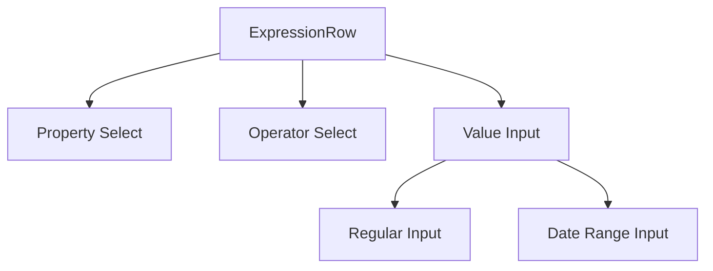

# System Patterns

## Expression Editor

### Component Architecture

1. Core Components
- ExpressionRow: Main component for individual expression rows
- ValueInput: Dynamic input component based on property type
- SelectInput: Reusable select component for properties and operators
- DatePicker: Used for datetime inputs

2. Data Flow

3. State Management
- Row-level state managed through props
- Property selection triggers operator options update
- Operator selection determines value input type
- Value validation based on property type and operator

4. Validation Patterns
- Field-level validation messages
- Conditional validation based on field visibility
- Type-specific validation rules
- Date range specific validation for 'IN' operator

### Layout Patterns

1. Grid System
- Main layout: 4-column grid
- Proportional column widths
- Consistent spacing using gap utilities

2. Flexbox Usage
- Vertical stacking of field groups
- Alignment of validation messages
- Date range input layout
- Button alignment

3. Error Handling
- Inline error messages
- Consistent styling
- Conditional rendering
- Clear visual feedback 