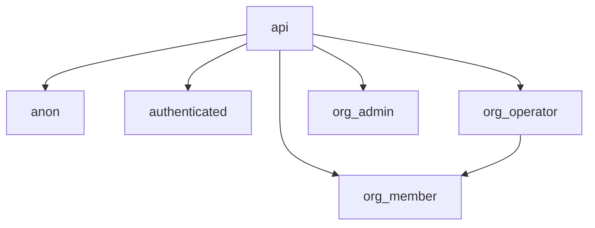

# System Patterns

## Architecture Overview

Spower follows a modern frontend architecture with:

- Monorepo structure using Nx
- Component-based development with React
- State management with React Query
- Type-safe development with TypeScript
- API integration with PocketBase and PostgREST
- Secure database access with Row Level Security

## Project Structure

```
apps/
  spower/
    src/         # Main application source
      components/  # Reusable UI components
      routes/      # Application routes and pages
      modules/     # Domain-specific modules
libs/
  api/          # Shared API interfaces
    src/
      api/        # API definitions and types
  core/         # Shared core functionality
    src/
      client/     # API client configuration
```

## Key Technical Patterns

### 1. Component Patterns

- Functional components with TypeScript
- Props interface defined with `type`
- React Query Kit for API calls
- Hooks for shared logic
- Shadcn/UI for consistent components

### 2. State Management

- Tanstack Query for server state
- React Query Kit for API interfaces
- Local state with React hooks
- Optimistic updates for better UX

### 3. Routing

- Tanstack Router for type-safe routing
- Nested routes for complex views
- Route-specific loaders for data fetching
- Type-safe search params

### 4. Data Display

- Tanstack Table for data grids
- Tanstack Virtual for large lists
- Virtualized rows for performance
- Infinite scrolling for pagination

## Component Relationships

- Clear separation between apps and libs
- Shared core functionality in libs
- Reusable components in core library
- API interfaces in dedicated library
- Domain-specific components organized by feature

## Form Validation Patterns

### Delayed Validation Display

- Validation errors are not shown immediately on field change
- Errors only appear after first form submission attempt
- After first submit, validation runs on field changes
- This pattern reduces visual noise and improves initial UX

### Sequential Input Display

- Fields are shown progressively based on dependencies
- Parent fields are always visible
- Child fields appear only when parent fields have valid values
- This pattern guides users through complex forms

## Data Handling Patterns

### DateTime Handling

- ISO string format for API communication
- Local date display in UI using formatDateTime
- Consistent parsing and formatting across components
- Special handling for date ranges in expressions

### Expression Editor Pattern

- Condition string parsing with regex
- Operator mapping for different data types
- Value formatting based on property type
- Support for complex date range conditions

## UI/UX Patterns

### Layout Patterns

- Main content wrapped in responsive containers
- Consistent spacing with TailwindCSS
- Fixed container heights with scrollable content
- Clear visual hierarchy for nested components
- Responsive design for various screen sizes

### Error Handling

- Clear error messages below affected fields
- Contextual validation based on field dependencies
- Non-blocking validation for better UX
- Vietnamese language error messages

## Data Access Patterns

### Database Security Model

#### 1. Role Hierarchy



#### 2. Row Level Security (RLS)

- All tables have RLS enabled
- Policies enforce organization-based isolation
- JWT claims used for user context
- Helper functions for claim extraction:
  - current_user_id()
  - current_organization_id()
  - current_jwt_role()

#### 3. Access Control Patterns

- SELECT policies based on organization_id
- INSERT policies with role checks
- UPDATE policies with role and organization checks
- DELETE policies with elevated role requirements

#### 4. Special Cases

- Organizations table: visibility based on creation or membership
- Organization members: admin-only management
- Message-related tables: complex relationship-based access

### Data Isolation

#### 1. Organization Context

- Every table includes organization_id
- Automatic filtering via RLS policies
- Cross-organization data access prevented

#### 2. Role-Based Access

- org_member: Basic read/write access
- org_operator: Enhanced management capabilities
- org_admin: Full administrative control

#### 3. JWT Integration

- Claims include email, org_id, and role
- Claims used for dynamic policy enforcement
- Automatic context switching between organizations

## Error Handling Pattern

### API Error Structure

```typescript
try {
  // API call
  const { data, error } = await client2.rest...

  if (error) {
    throw error; // Direct throw without wrapping
  }

  if (!data) {
    throw new Error('Không có dữ liệu trả về');
  }

  return data;
} catch (error) {
  // Single error wrapping with Vietnamese message
  throw new Error(`Không thể ${action}: ${(error as Error).message}`);
}
```

### Error Message Categories

1. List Operations

   ```typescript
   `Không thể lấy danh sách ${entity}: ${error.message}`;
   ```

2. Detail Operations

   ```typescript
   `Không thể lấy thông tin ${entity}: ${error.message}`;
   ```

3. Create Operations

   ```typescript
   `Không thể tạo ${entity}: ${error.message}`;
   ```

4. Update Operations

   ```typescript
   `Không thể cập nhật ${entity}: ${error.message}`;
   ```

5. Delete Operations

   ```typescript
   `Không thể xóa ${entity}: ${error.message}`;
   ```

6. Not Found Errors
   ```typescript
   `Không tìm thấy ${entity} với id: ${id}`;
   ```

### Implementation Guidelines

- Throw raw errors from if(error) blocks
- Wrap errors only once in catch blocks
- Use clear Vietnamese messages
- Include original error message
