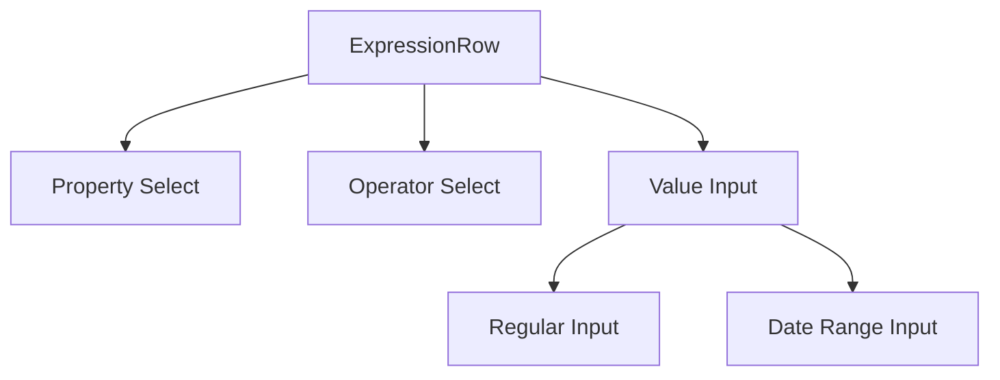

# System Patterns

## Architecture Overview

Spower follows a modern frontend architecture with:

- Monorepo structure using Nx
- Component-based development with React
- State management with React Query
- Type-safe development with TypeScript
- API integration with PocketBase and PostgREST
- Secure database access with Row Level Security

## Project Structure

```
apps/
  spower/
    src/         # Main application source
libs/
  api/          # Shared API interfaces
    src/
  core/         # Shared core functionality
    src/
```

## Key Technical Patterns

1. Component Patterns

   - Functional components with TypeScript
   - Props interface defined with `type`
   - React Query Kit for API calls
   - Hooks for shared logic

2. State Management

   - Tanstack Query for server state
   - React Query Kit for API interfaces
   - Local state with React hooks

3. Routing

   - Tanstack Router for type-safe routing
   - Nested routes for complex views

4. Data Display
   - Tanstack Table for data grids
   - Tanstack Virtual for large lists
   - Shadcn components for UI elements

## Component Relationships

- Clear separation between apps and libs
- Shared core functionality in libs
- Reusable components in core library
- API interfaces in dedicated library

## Form Validation Patterns

### Delayed Validation Display

- Validation errors are not shown immediately on field change
- Errors only appear after first form submission attempt
- After first submit, validation runs on field changes
- This pattern reduces visual noise and improves initial UX

### Sequential Input Display

- Fields are shown progressively based on dependencies
- Parent fields are always visible
- Child fields appear only when parent fields have valid values
- This pattern guides users through complex forms

## Data Handling Patterns

### DateTime Handling

- ISO string format for API communication
- Local date display in UI
- Consistent parsing and formatting across components

- Special handling for date ranges in expressions

### Expression Editor Pattern

- Condition string parsing with regex
- Operator mapping for different data types
- Value formatting based on property type
- Support for complex date range conditions

## UI/UX Patterns

### Form Layout

- Consistent spacing between form sections

- Fixed container heights with scrollable content
- Clear visual hierarchy for nested components
- Responsive design for various screen sizes

### Error Handling

- Clear error messages below affected fields
- Contextual validation based on field dependencies
- Non-blocking validation for better UX
- Proper error state management in forms

## Expression Editor

### Component Architecture

1. Core Components

- ExpressionRow: Main component for individual expression rows
- ValueInput: Dynamic input component based on property type
- SelectInput: Reusable select component for properties and operators
- DatePicker: Used for datetime inputs

2. Data Flow



3. State Management

- Row-level state managed through props
- Property selection triggers operator options update
- Operator selection determines value input type
- Value validation based on property type and operator

4. Validation Patterns

- Field-level validation messages
- Conditional validation based on field visibility
- Type-specific validation rules

- Date range specific validation for 'IN' operator

### Layout Patterns

1. Grid System

- Main layout: 4-column grid
- Proportional column widths
- Consistent spacing using gap utilities

2. Flexbox Usage

- Vertical stacking of field groups
- Alignment of validation messages
- Date range input layout
- Button alignment

3. Error Handling

- Inline error messages
- Conditional rendering based on field visibility
- Consistent styling with text-xs and text-red-500
- Clear visual feedback

## Data Access Patterns

### Database Security Model

1. Role Hierarchy

   ```mermaid
   graph TD
       A[api] --> B[anon]
       A --> C[authenticated]
       A --> D[org_member]
       A --> E[org_operator]
       A --> F[org_admin]
       E --> D
   ```

2. Row Level Security (RLS)

   - All tables have RLS enabled
   - Policies enforce organization-based isolation
   - JWT claims used for user context
   - Helper functions for claim extraction:
     - current_user_id()
     - current_organization_id()
     - current_jwt_role()

3. Access Control Patterns

   - SELECT policies based on organization_id
   - INSERT policies with role checks
   - UPDATE policies with role and organization checks
   - DELETE policies with elevated role requirements

4. Special Cases
   - Organizations table: visibility based on creation or membership
   - Organization members: admin-only management
   - Message-related tables: complex relationship-based access

### Data Isolation

1. Organization Context

   - Every table includes organization_id
   - Automatic filtering via RLS policies
   - Cross-organization data access prevented

2. Role-Based Access

   - org_member: Basic read/write access
   - org_operator: Enhanced management capabilities
   - org_admin: Full administrative control

3. JWT Integration
   - Claims include email, org_id, and role
   - Claims used for dynamic policy enforcement
   - Automatic context switching between organizations

## Error Handling Pattern

### API Error Structure

```typescript
try {
  // API call
  const { data, error } = await client2.rest...

  if (error) {
    throw error; // Direct throw without wrapping
  }

  if (!data) {
    throw new Error('Không có dữ liệu trả về');
  }

  return data;
} catch (error) {
  // Single error wrapping with Vietnamese message
  throw new Error(`Không thể ${action}: ${(error as Error).message}`);
}
```

### Error Message Categories

1. List Operations

   ```typescript
   `Không thể lấy danh sách ${entity}: ${error.message}`;
   ```

2. Detail Operations

   ```typescript
   `Không thể lấy thông tin ${entity}: ${error.message}`;
   ```

3. Create Operations

   ```typescript
   `Không thể tạo ${entity}: ${error.message}`;
   ```

4. Update Operations

   ```typescript
   `Không thể cập nhật ${entity}: ${error.message}`;
   ```

5. Delete Operations

   ```typescript
   `Không thể xóa ${entity}: ${error.message}`;
   ```

6. Not Found Errors
   ```typescript
   `Không tìm thấy ${entity} với id: ${id}`;
   ```

### Implementation Guidelines

1. Error Propagation

   - Throw raw errors from if(error) blocks
   - Wrap errors only once in catch blocks
   - Use clear Vietnamese messages
   - Include original error message

2. Error Categories
   - Use consistent message format
   - Follow Vietnamese translation pattern
   - Keep messages clear and concise
   - Include relevant context
