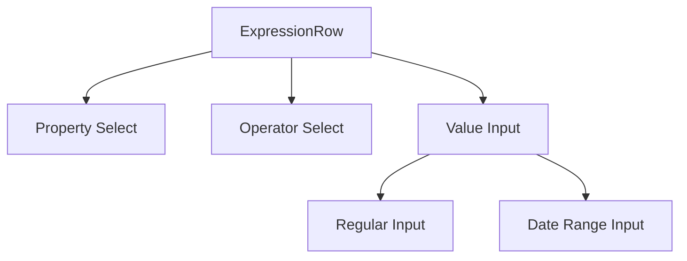

# System Patterns

## Architecture Overview

Spower follows a modern frontend architecture with:

- Monorepo structure using Nx
- Component-based development with React
- State management with React Query
- Type-safe development with TypeScript
- API integration with PocketBase

## Project Structure

```
apps/
  spower/
    src/         # Main application source
libs/
  api/          # Shared API interfaces
    src/
  core/         # Shared core functionality
    src/
```

## Key Technical Patterns

1. Component Patterns
   - Functional components with TypeScript
   - Props interface defined with `type`
   - React Query Kit for API calls
   - Hooks for shared logic

2. State Management
   - Tanstack Query for server state
   - React Query Kit for API interfaces
   - Local state with React hooks

3. Routing
   - Tanstack Router for type-safe routing
   - Nested routes for complex views

4. Data Display
   - Tanstack Table for data grids
   - Tanstack Virtual for large lists
   - Shadcn components for UI elements

## Component Relationships

- Clear separation between apps and libs
- Shared core functionality in libs
- Reusable components in core library
- API interfaces in dedicated library

## Form Validation Patterns

### Delayed Validation Display

- Validation errors are not shown immediately on field change
- Errors only appear after first form submission attempt
- After first submit, validation runs on field changes
- This pattern reduces visual noise and improves initial UX

### Sequential Input Display

- Fields are shown progressively based on dependencies
- Parent fields are always visible
- Child fields appear only when parent fields have valid values
- This pattern guides users through complex forms

## Data Handling Patterns

### DateTime Handling

- ISO string format for API communication
- Local date display in UI
- Consistent parsing and formatting across components

- Special handling for date ranges in expressions

### Expression Editor Pattern

- Condition string parsing with regex
- Operator mapping for different data types
- Value formatting based on property type
- Support for complex date range conditions

## UI/UX Patterns

### Form Layout

- Consistent spacing between form sections

- Fixed container heights with scrollable content
- Clear visual hierarchy for nested components
- Responsive design for various screen sizes

### Error Handling

- Clear error messages below affected fields
- Contextual validation based on field dependencies
- Non-blocking validation for better UX
- Proper error state management in forms

## Expression Editor

### Component Architecture

1. Core Components

- ExpressionRow: Main component for individual expression rows
- ValueInput: Dynamic input component based on property type
- SelectInput: Reusable select component for properties and operators
- DatePicker: Used for datetime inputs

2. Data Flow



3. State Management

- Row-level state managed through props
- Property selection triggers operator options update
- Operator selection determines value input type
- Value validation based on property type and operator

4. Validation Patterns

- Field-level validation messages
- Conditional validation based on field visibility
- Type-specific validation rules

- Date range specific validation for 'IN' operator

### Layout Patterns

1. Grid System

- Main layout: 4-column grid
- Proportional column widths
- Consistent spacing using gap utilities

2. Flexbox Usage

- Vertical stacking of field groups
- Alignment of validation messages
- Date range input layout
- Button alignment

3. Error Handling

- Inline error messages
- Conditional rendering based on field visibility
- Consistent styling with text-xs and text-red-500
- Clear visual feedback
